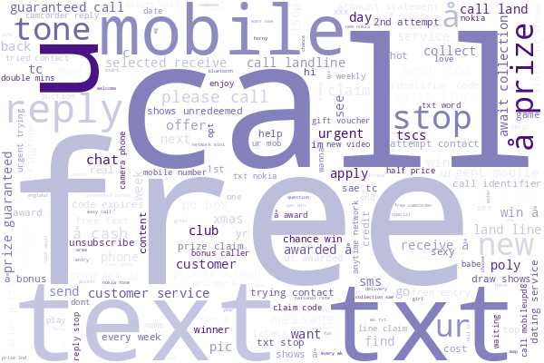
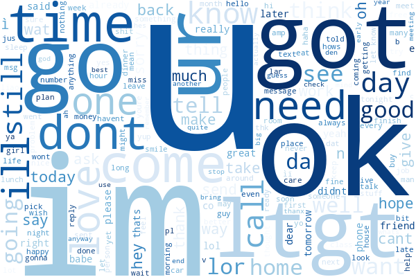

# 📩 SMS Spam Detector – NLP & Metadata Machine Learning Project

A complete end-to-end machine learning pipeline for detecting spam messages using both natural language processing (NLP) and engineered metadata features. The project achieves **99.89% F1-score** using Logistic Regression with CountVectorizer and SMOTE oversampling.

---

## 🚀 Project Overview

This project tackles the **SMS Spam Classification** problem using a dataset of 5,574 messages labeled as either **ham (legitimate)** or **spam**. It involves:

- 🧹 Data Cleaning & Deduplication  
- 🧠 Feature Engineering (Text + Metadata)  
- 📊 Exploratory Data Analysis (EDA)  
- 🧾 Text Vectorization using CountVectorizer and TF-IDF  
- 🤖 Modeling with multiple ML algorithms  
- 🔧 Hyperparameter Tuning with Grid & Random Search  
- ✅ Final Deployment Testing with live message predictions

---

## 📁 Dataset

- **Source:** [UCI SMS Spam Collection](https://www.kaggle.com/datasets/uciml/sms-spam-collection-dataset)
- **Size:** 5,574 messages  
- **Columns:**
  - `v1` — label (ham or spam)
  - `v2` — SMS text message

---

## 🧠 Feature Engineering

In addition to text preprocessing, the following metadata features were engineered:

| Feature Name         | Description                                         |
|----------------------|-----------------------------------------------------|
| `message_len`        | Length of the message (characters)                 |
| `word_count`         | Total word count                                   |
| `digit_count`        | Number of digits                                   |
| `ex_count`           | Number of exclamation marks                        |
| `has_link`           | Whether a link is present (1/0)                    |
| `punct_percent`      | Punctuation-to-character ratio                     |
| `capitalized_count`  | Number of fully capitalized words                  |
| `capitalized_ratio`  | Ratio of capitalized words to total words          |
| `free/win/..._count` | Keyword frequencies for 7 spam trigger words       |
| `unique_word_count`  | Number of unique words                             |
| `avg_word_length`    | Average word length                                |

---

## ✨ Exploratory Data Analysis (EDA)

- 📦 Distribution of Ham vs Spam
- 📈 Feature histograms and boxplots
- ☁️ WordClouds for Spam and Ham
- 🔗 Insights on links, punctuation, keyword triggers

---

## 🛠️ Modeling & Evaluation

### ✅ Models Used:

- `Multinomial Naive Bayes`
- `Complement Naive Bayes`
- `Logistic Regression` (best)

### ✅ Vectorizers:

- `TF-IDF`
- `CountVectorizer` (best)

### 🧪 Results (Before Tuning):

| Vectorizer | Model             | Accuracy | Precision | Recall | F1 Score | AUC   |
|------------|-------------------|----------|-----------|--------|----------|--------|
| CountVec   | LogisticRegression| 0.9978   | 0.9989    | 0.9967 | 0.9978   | 1.0000 |
| CountVec   | MultinomialNB     | 0.9923   | 0.9871    | 0.9978 | 0.9925   | 0.9998 |
| CountVec   | ComplementNB      | 0.9923   | 0.9871    | 0.9978 | 0.9925   | 0.9998 |

### 🧪 After Hyperparameter Tuning:

| Model             | Accuracy | Precision | Recall | F1 Score | AUC   | Best Params |
|------------------|----------|-----------|--------|----------|--------|-------------|
| LogisticRegression | 0.9989 | 0.9989    | 0.9989 | 0.9989   | 1.0    | `C=10`, solver=`liblinear` |
| MultinomialNB     | 0.9950   | 0.9903    | 1.0000 | 0.9951   | 1.0    | alpha=`0.1` |
| ComplementNB      | 0.9950   | 0.9903    | 1.0000 | 0.9951   | 1.0    | alpha=`0.1` |

---

## 🧪 Live Testing

The final model was tested with real-world messages.  
✅ Only 1 message was misclassified out of 21.

### Example Prediction Output:

```bash
📩 Message: Win a FREE vacation to the Bahamas now! Click to claim.
Confidence: 83.5% Spam
Prediction: 🚨 Spam

📩 Message: Hey, can you send me the notes from class?
Confidence: 0.18% Spam
Prediction: ✅ Ham
```

## 🧰 Tools Used

- **Python:** Pandas, NumPy, Matplotlib, Seaborn  
- **Scikit-learn:** Model building, vectorizers, pipelines, hyperparameter tuning  
- **imbalanced-learn:** SMOTE for handling class imbalance  
- **NLP:** CountVectorizer, TF-IDF, Stopwords removal  
- **Others:** WordCloud, AUC computation, Confusion Matrix visualization  

---

## 🌩️ Spam vs Ham WordClouds

| Spam Messages                         | Ham Messages                          |
|--------------------------------------|---------------------------------------|
|  |    |

---

## 🧠 Author
- Reza Zare | Data Analyst | NLP & ML Enthusiast
